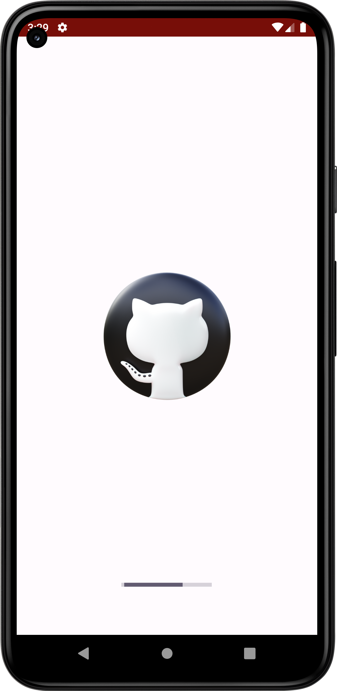
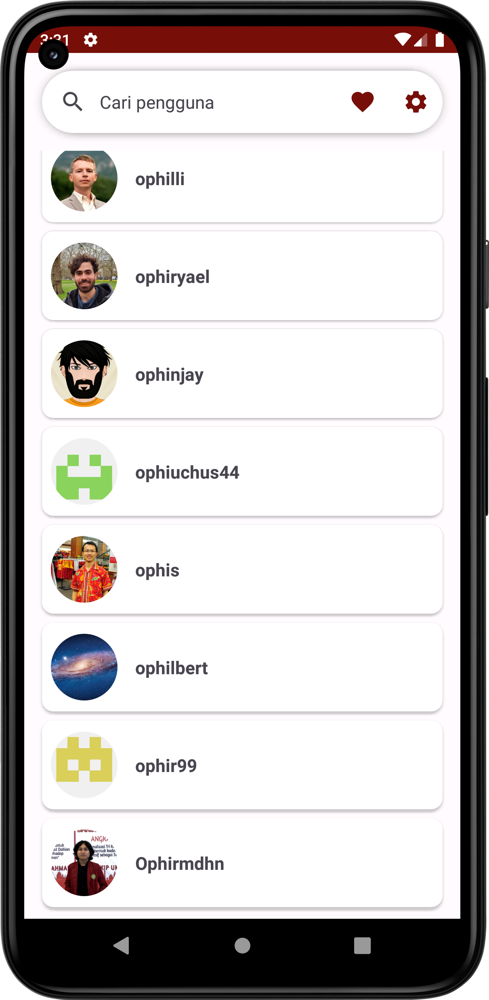
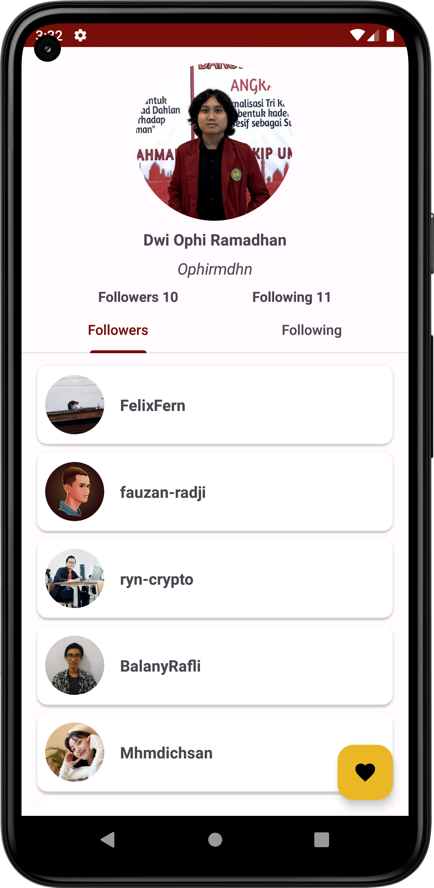
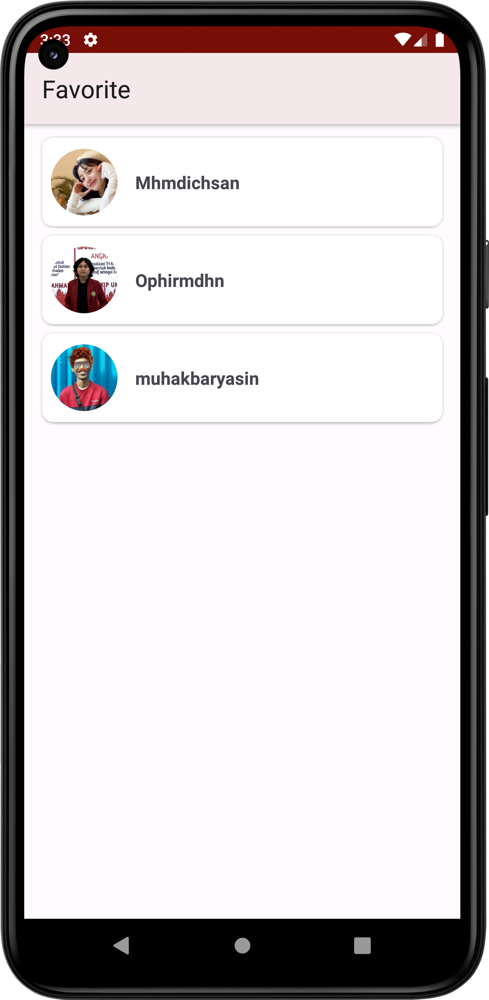
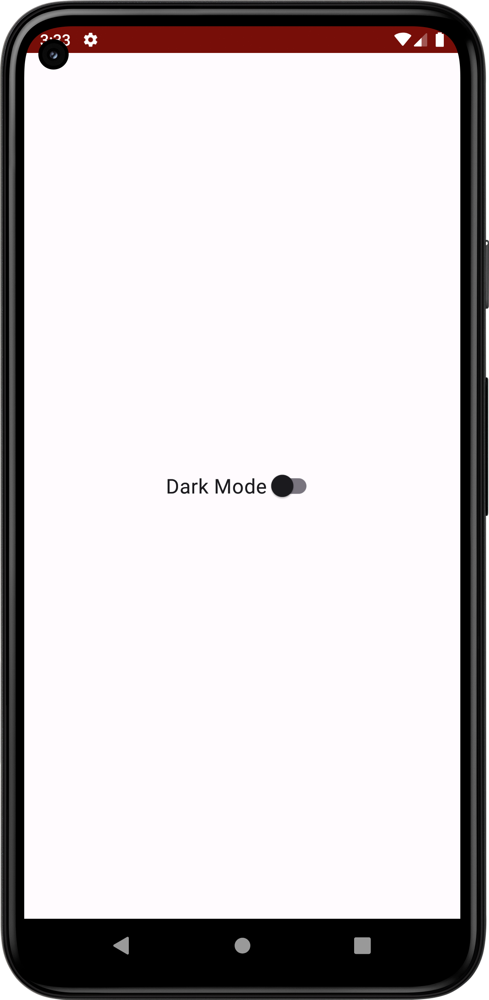

# Github User App

Aplikasi Github User merupakan aplikasi berbasis Android dengan menggunakan data dari API Github.

## Feature
- Search User
- Favorite User
- Dark Mode

## Language and Tools

  
  
  

## Screenshots

  <figure>
    <figcaption>Splash Screen</figcaption>
    
  </figure>
  <figure>
    <figcaption>Main Activity</figcaption>
    
  </figure>
  <figure>
    <figcaption>Detail Activity</figcaption>
    
  </figure>
  <figure>
    <figcaption>Favorite Activity</figcaption>
    
  </figure>
  <figure>
    <figcaption>Switch Theme Activity</figcaption>
    
  </figure>

